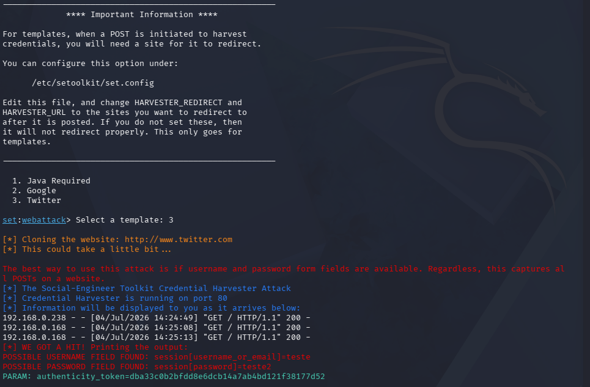

# Desafio DIO - Simulação de Phishing com SEToolkit

## Sobre o projeto

Este projeto foi desenvolvido como parte do curso de Cybersecurity da DIO, no módulo sobre engenharia social e simulação de phishing utilizando o SEToolkit.

O objetivo do desafio foi entender, em ambiente controlado, como funciona uma simulação de captura de dados por meio do método Credential Harvester Attack Method.

## Problema encontrado

Inicialmente, o desafio propunha a clonagem da página do Facebook.

Porém, ao tentar clonar o site, o SEToolkit retornou o seguinte erro:

> Error. Unable to clone this specific site. Check your internet connection.

Apesar da conexão com a internet estar funcionando normalmente, o erro provavelmente ocorreu porque sites modernos, como Facebook, utilizam proteções contra clonagem automatizada, carregamento dinâmico por JavaScript, políticas de segurança e mecanismos anti-phishing.

Por esse motivo, o teste foi adaptado para utilizar um template interno do próprio SEToolkit.

## Ferramentas utilizadas

- Kali Linux
- SEToolkit
- Credential Harvester Attack Method
- Template interno do SEToolkit
- Rede local para ambiente de testes

## Execução

Durante o teste, foi selecionado um template disponível no SEToolkit.

O serviço foi iniciado localmente na porta 80, permitindo acessar a página simulada pela rede interna.

Após inserir dados fictícios no formulário, o SEToolkit registrou uma requisição POST e exibiu no terminal os campos enviados.

Exemplo do resultado observado:

- Username capturado: teste
- Password capturado: teste2
- Parâmetro adicional identificado: authenticity_token

## Evidência do teste

Abaixo está o print da execução do SEToolkit durante o desafio:

## Resultado

O teste demonstrou com sucesso o funcionamento básico de uma simulação de phishing em ambiente controlado.

Foi possível observar:

- criação de uma página simulada;
- execução do servidor local pelo SEToolkit;
- acesso à página pela rede interna;
- envio de dados fictícios;
- identificação dos campos enviados pelo formulário.

## Conclusão

O desafio permitiu compreender, de forma prática, como páginas falsas podem ser utilizadas para capturar informações inseridas por usuários.

Também foi possível perceber que sites modernos possuem diversas proteções que dificultam a clonagem direta por ferramentas automatizadas.

Por isso, para fins educacionais, o uso de templates ou ambientes próprios de laboratório é uma alternativa mais adequada, segura e ética.

## Aviso ético

Este projeto foi realizado exclusivamente para fins de estudo, em ambiente local e controlado, utilizando dados fictícios.

Nenhuma credencial real foi utilizada, armazenada ou divulgada.

O uso de técnicas de phishing contra terceiros, sistemas reais ou pessoas sem autorização é ilegal e antiético.
